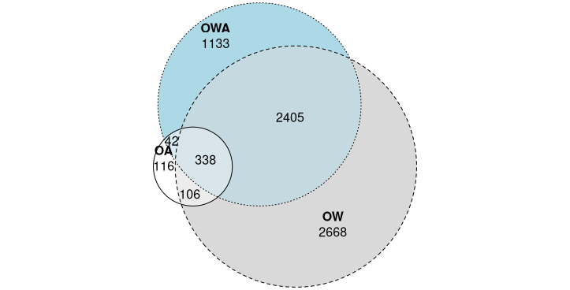
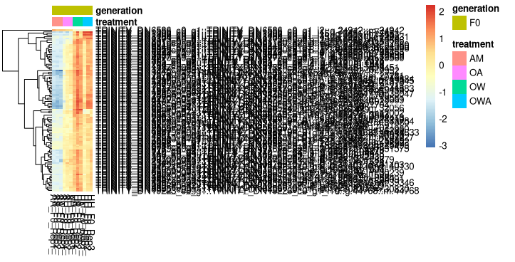
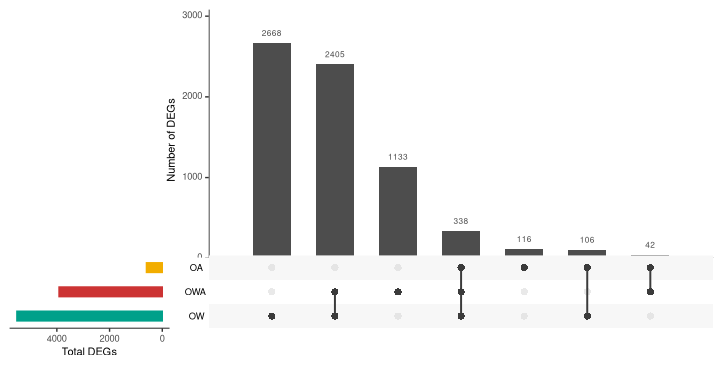
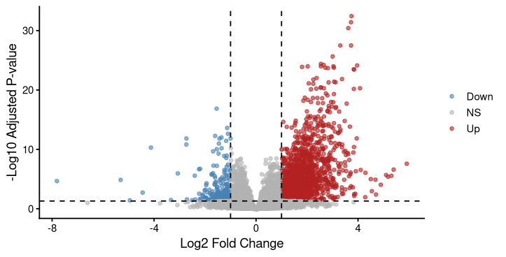
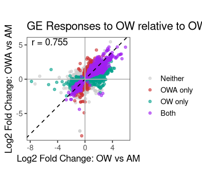

# Transcriptomics Notebook

**Course:** Intro to Ecological Genomics - Fall 2026

**Name:** Emma Shaw

------------------------------------------------------------------------

## 9.15.2026 - Setting up lab notebook and learning markdown

-   Setting up transcriptomics notebooks

-   Learn how to take notes in markdown

-   Push notes to github

-   

**Working Directory:**

`/gpfs1/home/e/s/eshaw7/projects/eco_genomics__2026/transcriptomics`

**Input Files:**

`none`

**Output Files:**

`/gpfs1/home/e/s/eshaw7/projects/eco_genomics__2026/transcriptomics/transcriptomics_notebook.md`

**Programs and dependencies**:

-   `R version 4.5.1`

-   `R-Studio`

**Scripts:**

`none`

**Code:**

\`print("Hello world")

**Table:**

| Col1 | Col2 | Col3 |
|------|------|------|
|      |      |      |
|      |      |      |
|      |      |      |

**Image:**

------------------------------------------------------------------------

## 9.17.2026 - Introduction to the study system and review of transcriptomics pipeline

-   introduction to copepod ecology and previous work

-   brainstorm questions to explore with copepods

-   examine fastq files

-   revisit transcriptomics pipeline with copepod application

**Working Directory:**

`/gpfs1/home/e/s/eshaw7/projects/eco_genomics__2026/transcriptomics`

`/gpfs1/cl/biol3990`

**Input Files:**

`none`

**Output Files:**

`/gpfs1/home/e/s/eshaw7/projects/eco_genomics__2026/transcriptomics/transcriptomics_notebook.md`

**Programs and dependencies**:

-   `R version 4.5.1`

-   `R-Studio`

**Scripts:**

`none`

**Code:**

```         
# Useful commands for VACC shell access

# Change directory to class directory
cd /gpfs1/cl/biol3990

# Print working directory 
pwd

# Make a list of what is inthe current directory 
ls
ll

# Open a .fq file 
zcat

# Open just the top of a zcat file 
zcat | head

# Copy a file or directory and move it to another directory
cp whateveryouwanttocopy whereyouwanttopasteit

# Remove a file from current directory
rm
```

------------------------------------------------------------------------

## 9.22.2026 - Transcriptomics Day 3

-   set up R environment

-   created myresults, mydata, and myscripts directories

-   added mydata directory to gitignore

-   populated mydata directory with counts matrix

-   copied the data to import into DESeq2 and R

-   created a deseq2 object for our data

-   visualized outliers

**Working Directory:**

`/gpfs1/home/e/s/eshaw7/projects/eco_genomics__2026/transcriptomics/myscripts`

**Input Files:**

`/gpfs1/home/e/s/eshaw7/projects/eco_genomics__2026/transcriptomics/mydata/salmon.isoform.counts.matrix.filteredAssembly`

`gpfs1/home/e/s/eshaw7/projects/eco_genomics__2026/transcriptomics/mydata/ahud_samples_R.txt`

**Output Files:**

`/gpfs1/home/e/s/eshaw7/projects/eco_genomics__2026/transcriptomics/myresults/PCA_allGens.png`

**Programs and dependencies**:

-   `R version 4.5.1`

-   `R-Studio`

**Scripts:**

`/gpfs1/home/e/s/eshaw7/projects/eco_genomics__2026/transcriptomics/myscripts/ahud_DESeq2_inclass.R`

**Code:**

```         
## Set your working directory
setwd("/gpfs1/home/e/s/eshaw7/projects/eco_genomics_2026/transcriptomics")

## Import the libraries that we're likely to need in this session

library(DESeq2)
library(dplyr)
library(tidyr)
library(ggplot2)
library(scales)
library(ggpubr)
library(vsn)  
library("pheatmap")
library("vsn")

####################################################

### Import our data

####################################################


# Import the counts matrix from mydata directory. This file contains counts for each gene for each sample. It is a BIG file

countsTable <- read.table("mydata/salmon.isoform.counts.matrix.filteredAssembly", header=TRUE, row.names=1)
head(countsTable)
dim(countsTable)

# Rund the numbers in the counts file because DESeq2 doesn't like decimals. Create countsTableRound

countsTableRound <- round(countsTable) # bc DESeq2 doesn't like decimals (and Salmon outputs data with decimals)
head(countsTableRound)

#import the sample description table
conds <- read.delim("mydata/ahud_samples_R.txt", header=TRUE, stringsAsFactors = TRUE, row.names=1)
head(conds)
####################################################

### Explore data distributions

####################################################

# Let's see how many reads we have from each sample
colSums(countsTableRound)
mean(colSums(countsTableRound))

# create a bar plot to visualize how many counts there are in each sample
barplot(colSums(countsTableRound), names.arg=colnames(countsTableRound),cex.names=0.5, las=3,ylim=c(0,21000000))
abline(h=mean(colSums(countsTableRound)), col="blue", lwd=2)

# the average number of counts per gene
rowSums(countsTableRound)
mean(rowSums(countsTableRound)) # [1] 8217.81
median(rowSums(countsTableRound)) # [1] 377

# Make a histogram to visualize the mean counts across rows and columns
apply(countsTableRound,2,mean) # 2 in the apply function does the action across columns
apply(countsTableRound,1,mean) # 1 in the apply function does the action across rows
hist(apply(countsTableRound,1,mean),xlim=c(0,1000), ylim=c(0,10000),breaks=10000)
####################################################

### Start working with DESeq2!

####################################################

#### Create a DESeq object and define the experimental design here with the tilda

dds <- DESeqDataSetFromMatrix(countData = countsTableRound, colData=conds, 
                              design= ~ generation + treatment)

dim(dds)

# Filter out genes with too few reads - remove all genes with counts < 15 in more than 75% of samples, so ~28)
## suggested by WGCNA on RNAseq FAQ

dds <- dds[rowSums(counts(dds) >= 15) >= 28,]
nrow(dds) 
# [1] 25260, that have at least 15 reads (a.k.a counts) in 75% of the samples

# Run the DESeq model to test for differential gene expression
dds <- DESeq(dds)

# List the results you've generated
resultsNames(dds)
# Copy the results names 
# [1] "Intercept"            "generation_F11_vs_F0" "generation_F2_vs_F0" 
# [4] "generation_F4_vs_F0"  "treatment_OA_vs_AM"   "treatment_OW_vs_AM"  
# [7] "treatment_OWA_vs_AM" 

# Now let's transform our data so that we can make a PCA plot

# The goal of transformation "is to remove the dependence of the variance on the mean, particularly the high variance of the logarithm of count data when the mean is low."

# this gives log2(n + 1)
ntd <- normTransform(dds)
meanSdPlot(assay(ntd))

# Variance stabilizing transformation
vsd <- vst(dds, blind=FALSE)
meanSdPlot(assay(vsd))

# This next bit of code lets us look for any outliers

sampleDists <- dist(t(assay(vsd)))

library("RColorBrewer")
sampleDistMatrix <- as.matrix(sampleDists)
rownames(sampleDistMatrix) <- paste(vsd$line, vsd$generation, sep="-")
colnames(sampleDistMatrix) <- NULL
colors <- colorRampPalette( rev(brewer.pal(9, "Blues")) )(255)
pheatmap(sampleDistMatrix,
         clustering_distance_rows=sampleDists,
         clustering_distance_cols=sampleDists,
         col=colors)

# Note any outliers - maybe AH (OA) F2 rep 2

sampleTree <- hclust(dist(sampleDists), method="average")
# plot
plot(sampleTree, main="Sample clustering to detect outliers", sub="", xlab="",cex.lab=1.5, cex.axis=1.5, cex.main=2)

# first transform the data for plotting using variance stabilization
vsd <- vst(dds, blind=FALSE)

pcaData <- plotPCA(vsd, intgroup=c("treatment","generation"), returnData=TRUE)
percentVar <- round(100 * attr(pcaData,"percentVar"))

ggplot(pcaData, aes(PC1, PC2, color=treatment, shape=generation)) +
  geom_point(size=3) +
  xlab(paste0("PC1: ",percentVar[1],"% variance")) +
  ylab(paste0("PC2: ",percentVar[2],"% variance")) + 
  coord_fixed()

# Let's make this prettier and easier to interpret by seperating the generations
###############################################################

# Let's plot the PCA by generation in four panels

data <- plotPCA(vsd, intgroup=c("treatment","generation"), returnData=TRUE)
percentVar <- round(100 * attr(data,"percentVar"))

###########  

dataF0 <- subset(data, generation == 'F0')

F0 <- ggplot(dataF0, aes(PC1, PC2)) +
  geom_point(size=10, stroke = 1.5, aes(fill=treatment, shape=treatment)) +
  xlab(paste0("PC1: ",percentVar[1],"% variance")) +
  ylab(paste0("PC2: ",percentVar[2],"% variance")) +
  ylim(-10, 25) + xlim(-40, 10)+ # zoom for F0 with new assembly
  scale_shape_manual(values=c(21,22,23,24), labels = c("Ambient", "Acidification","Warming", "OWA"))+
  scale_fill_manual(values=c('#6699CC',"#F2AD00","#00A08A", "#CC3333"), labels = c("Ambient", "Acidification","Warming", "OWA"))+
  theme_bw() +
  theme(legend.position = "none") +
  theme(panel.border = element_rect(color = "black", fill = NA, size = 4))+
  theme(text = element_text(size = 20)) +
  theme(legend.title = element_blank())

F0


################# F2

dataF2 <- subset(data, generation == 'F2')

F2 <- ggplot(dataF2, aes(PC1, PC2)) +
  geom_point(size=10, stroke = 1.5, aes(fill=treatment, shape=treatment)) +
  xlab(paste0("PC1: ",percentVar[1],"% variance")) +
  ylab(paste0("PC2: ",percentVar[2],"% variance")) +
  ylim(-40, 25) + xlim(-50, 55)+
  scale_shape_manual(values=c(21,22,23), labels = c("Ambient", "Acidification","Warming"))+
  scale_fill_manual(values=c('#6699CC',"#F2AD00","#00A08A"), labels = c("Ambient", "Acidification","Warming"))+
  theme(legend.position = c(0.83,0.85), legend.background = element_blank(), legend.box.background = element_rect(colour = "black")) +
  guides(shape = guide_legend(override.aes = list(shape = c( 21,22, 23))))+
  guides(fill = guide_legend(override.aes = list(shape = c( 21,22, 23))))+
  guides(shape = guide_legend(override.aes = list(size = 5)))+
  theme_bw() +
  theme(legend.position = "none") +
  theme(panel.border = element_rect(color = "black", fill = NA, size = 4))+
  theme(text = element_text(size = 20)) +
  theme(legend.title = element_blank())
F2

# Yes - F2 is missing one ambient replicate

################################ F4

dataF4 <- subset(data, generation == 'F4')

F4 <- ggplot(dataF4, aes(PC1, PC2)) +
  geom_point(size=10, stroke = 1.5, aes(fill=treatment, shape=treatment)) +
  xlab(paste0("PC1: ",percentVar[1],"% variance")) +
  ylab(paste0("PC2: ",percentVar[2],"% variance")) +
  ylim(-40, 25) + xlim(-50, 55)+ # limits with filtered assembly
  scale_shape_manual(values=c(21,22,23,24), labels = c("Ambient", "Acidification","Warming", "OWA"))+
  scale_fill_manual(values=c('#6699CC',"#F2AD00","#00A08A", "#CC3333"), labels = c("Ambient", "Acidification","Warming", "OWA"))+
  guides(shape = guide_legend(override.aes = list(shape = c( 21,22, 23, 24))))+
  guides(fill = guide_legend(override.aes = list(shape = c( 21,22, 23, 24))))+
  guides(shape = guide_legend(override.aes = list(size = 5)))+
  theme_bw() +
  theme(legend.position = "none") +
  theme(panel.border = element_rect(color = "black", fill = NA, size = 4))+
  theme(text = element_text(size = 20)) +
  theme(legend.title = element_blank())
F4


################# F11

dataF11 <- subset(data, generation == 'F11')

F11 <- ggplot(dataF11, aes(PC1, PC2)) +
  geom_point(size=10, stroke = 1.5, aes(fill=treatment, shape=treatment)) +
  xlab(paste0("PC1: ",percentVar[1],"% variance")) +
  ylab(paste0("PC2: ",percentVar[2],"% variance")) +
  ylim(-45, 25) + xlim(-50, 55)+
  scale_shape_manual(values=c(21,24), labels = c("Ambient", "OWA"))+
  scale_fill_manual(values=c('#6699CC', "#CC3333"), labels = c("Ambient", "OWA"))+
  guides(shape = guide_legend(override.aes = list(shape = c( 21, 24))))+
  guides(fill = guide_legend(override.aes = list(shape = c( 21, 24))))+
  guides(shape = guide_legend(override.aes = list(size = 5)))+
  theme_bw() +
  theme(legend.position = "none") +
  theme(panel.border = element_rect(color = "black", fill = NA, size = 4))+
  theme(text = element_text(size = 20)) +
  theme(legend.title = element_blank())
F11


# png("PCA_F11.png", res=300, height=5, width=5, units="in")
# 
# ggarrange(F11, nrow = 1, ncol=1)
# 
# dev.off()

ggarrange(F0, F2, F4, F11, nrow = 2, ncol=2)

png("./myresults/PCA_allGens.png", res=300, height=5, width=5, units="in")

ggarrange(F0, F2, F4, F11, nrow = 2, ncol=2)

dev.off()
```

**Image:** 

------------------------------------------------------------------------

## 9.24.2026 - Transcriptomics Day 4

-   Reviewed terminology including bash commands/where things are

-   Reviewed script from yesterday

**Working Directory:**

`/gpfs1/home/e/s/eshaw7/projects/eco_genomics__2026/transcriptomics`

**Input Files:**

`none`

**Output Files:**

`/gpfs1/home/e/s/eshaw7/projects/eco_genomics__2026/transcriptomics/transcriptomics_notebook.md`

**Programs and dependencies**:

-   `R version 4.5.1`

-   `R-Studio`

**Scripts:**

`none`

**Code:**

```         
## Playing in R to understand basic R functions and objects####

# Assign a value to a variable
x <- 5

# Create a data frame
students <- data.frame(
  name = c("A","B","C"),
  height = c(62,68,72)
)

# head shows the top lines of an object
head(students)

# Class shows what type of object you are working with 
class(students)

# Str shows the structure of the object
str(students)

# $ allows you to pipe to something. [column,row] allow you to view a specific component of a dataframe

students$name[2]

students[1,2]

# Mean calculates the mean of numbers provided
mean(students$height)
```

------------------------------------------------------------------------

## 9.29.2026 - Transcriptomics Day 5

-   Looked at DESeq data within generation F0

-   generated a heatmap, upset plot, volcano plot, and euler venn diagram to visualize these data

**Working Directory:**

`/gpfs1/home/e/s/eshaw7/projects/eco_genomics__2026/transcriptomics`

**Input Files:**

`none`

**Output Files:**

`/gpfs1/home/e/s/eshaw7/projects/eco_genomics__2026/transcriptomics/transcriptomics_notebook.md`

**Programs and dependencies**:

-   `R version 4.5.1`

-   `R-Studio`

**Scripts:**

`/users/e/s/eshaw7/projects/eco_genomics__2026/transcriptomics/myscripts/9.29.26_AHUD_DESEQpt2.R`

**Code:**

```         
## Set your working directory
setwd("/project/eco_genomics_2026/transcriptomics/mydata/")

## Import the libraries that we're likely to need in this session

library(DESeq2)
library(dplyr)
library(tidyr)
library(ggplot2)
library(scales)
library(ggpubr)
library(wesanderson)
library(vsn)  


####################################################

### Import our data

####################################################


# Import the counts matrix
countsTable <- read.table("salmon.isoform.counts.matrix.filteredAssembly", header=TRUE, row.names=1)
head(countsTable)
dim(countsTable)

countsTableRound <- round(countsTable) # bc DESeq2 doesn't like decimals (and Salmon outputs data with decimals)
head(countsTableRound)

#import the sample description table
conds <- read.delim("ahud_samples_R.txt", header=TRUE, stringsAsFactors = TRUE, row.names=1)
head(conds)


dds <- DESeqDataSetFromMatrix(countData = countsTableRound, colData=conds, 
                              design= ~ treatment)
dim(dds)
# [1] 130580     38

# Filter out low counts
dds <- dds[rowSums(counts(dds) >= 15) >= 28,]
nrow(dds) 

# Subset the DESeqDataSet to the specific level of the "generation" factor
dds_F0 <- subset(dds, select = generation == 'F0')
dim(dds_F0)
# [1] 25260    12

# Perform DESeq2 analysis on the subset
dds_F0 <- DESeq(dds_F0)

####################################################

### Check on the DE results from the DESeq 

####################################################

resultsNames(dds_F0)
# [1] "Intercept"           "treatment_OA_vs_AM"  "treatment_OW_vs_AM"  "treatment_OWA_vs_AM"

res_OWAvsAM <- results(dds_F0, name="treatment_OWA_vs_AM", alpha=0.05)
res_OWAvsAM <- res_OWAvsAM[order(res_OWAvsAM$padj),]
head(res_OWAvsAM)  
summary(res_OWAvsAM)


res_OWvsAM <- results(dds_F0, name="treatment_OW_vs_AM", alpha=0.05)
res_OWvsAM <- res_OWvsAM[order(res_OWvsAM$padj),]
head(res_OWvsAM) 
summary(res_OWvsAM)

# And one more... ?!
res_OAvsAM <- results(dds_F0, name="treatment_OA_vs_AM", alpha=0.05)
res_OAvsAM <- res_OAvsAM[order(res_OAvsAM$padj),]
head(res_OAvsAM) 
summary(res_OAvsAM)
### Plot Individual genes ### 

# Counts of specific top interaction gene! (important validatition that the normalization, model is working)

d <-plotCounts(dds_F0, gene="TRINITY_DN33_c0_g1::TRINITY_DN33_c0_g1_i18::g.235::m.235", intgroup = (c("treatment")), returnData=TRUE)
d

p <-ggplot(d, aes(x=treatment, y=count, color=treatment)) + 
  theme_minimal() + theme(text = element_text(size=20), panel.grid.major=element_line(colour="grey"))
p <- p + geom_point(position=position_jitter(w=0.2,h=0), size=3)
p <- p + stat_summary(fun = mean, geom = "line")
p <- p + stat_summary(fun = mean, geom = "point", size=5, alpha=0.7) 
p

# Make an ma plot
plotMA(res_OWvsAM, ylim=c(-5,5))

# Make a volcano plot
volcano_df <- as.data.frame(res_OWvsAM)

volcano_df <- volcano_df %>%
  mutate(
    sig = case_when(
      padj < 0.05 & log2FoldChange > 1  ~ "Up",
      padj < 0.05 & log2FoldChange < -1 ~ "Down",
      TRUE ~ "NS"
    )
  )

ggplot(volcano_df,
       aes(x = log2FoldChange,
           y = -log10(padj),
           color = sig)) +
  geom_point(alpha = 0.6, size = 1.5) +
  scale_color_manual(values = c(
    "Down" = "steelblue",
    "NS"   = "grey70",
    "Up"   = "firebrick"
  )) +
  geom_vline(xintercept = c(-1, 1),
             linetype = "dashed") +
  geom_hline(yintercept = -log10(0.05),
             linetype = "dashed") +
  theme_classic(base_size = 14) +
  labs(
    x = "Log2 Fold Change",
    y = "-Log10 Adjusted P-value",
    color = NULL
  )
########################################

# Heatmap of top 20 genes sorted by pvalue

library(pheatmap)

# By environment
vsd <- vst(dds_F0, blind=FALSE)

topgenes <- head(rownames(res_OWvsAM),100)
mat <- assay(vsd)[topgenes,]
mat <- mat - rowMeans(mat)
df <- as.data.frame(colData(dds_F0)[,c("treatment", "generation")])
pheatmap(mat, annotation_col=df)
pheatmap(mat, annotation_col=df, cluster_cols = F)

# Make heatmap cleaner by removing rownames 
pheatmap(mat, annotation_col=df, cluster_cols = F, show_rownames = F)


#################################################################

#### PLOT OVERLAPPING DEGS IN VENN EULER DIAGRAM

#################################################################

# For OW vs AM
res_OWvsAM <- results(dds_F0, name="treatment_OW_vs_AM", alpha=0.05) # pull out the results for the contrast of interest
res_OWvsAM <- res_OWvsAM[order(res_OWvsAM$padj),] # order them by significance
res_OWvsAM <- res_OWvsAM[!is.na(res_OWvsAM$padj),] # get rid of any NAs
degs_OWvsAM <- row.names(res_OWvsAM[res_OWvsAM$padj < 0.05,]) # make a list of significant differentially expressed genes for this contrast

# For OA vs AM
res_OAvsAM <- results(dds_F0, name="treatment_OA_vs_AM", alpha=0.05)
res_OAvsAM <- res_OAvsAM[order(res_OAvsAM$padj),]
res_OAvsAM <- res_OAvsAM[!is.na(res_OAvsAM$padj),]
degs_OAvsAM <- row.names(res_OAvsAM[res_OAvsAM$padj < 0.05,])

# For OWA vs AM
res_OWAvsAM <- results(dds_F0, name="treatment_OWA_vs_AM", alpha=0.05)
res_OWAvsAM <- res_OWAvsAM[order(res_OWAvsAM$padj),]
res_OWAvsAM <- res_OWAvsAM[!is.na(res_OWAvsAM$padj),]
degs_OWAvsAM <- row.names(res_OWAvsAM[res_OWAvsAM$padj < 0.05,])

library(eulerr)

# Total
length(degs_OAvsAM)  # 602
length(degs_OWvsAM)  # 5517 
length(degs_OWAvsAM)  # 3918

# Intersections
length(intersect(degs_OAvsAM,degs_OWvsAM))  # 444
length(intersect(degs_OAvsAM,degs_OWAvsAM))  # 380
length(intersect(degs_OWAvsAM,degs_OWvsAM))  # 2743

# Shared across all
intWA <- intersect(degs_OAvsAM,degs_OWvsAM)
length(intersect(degs_OWAvsAM,intWA)) # 338

# Number unique to each treatment

602-444-380+338 # 116 OA
5517-444-2743+338 # 2668 OW 
3918-380-2743+338 # 1133 OWA

# Number shared in pairs of treatments

444-338 # 106 OA & OW
380-338 # 42 OA & OWA
2743-338 # 2405 OWA & OW

# Now assemble the results
# Note that the names are important and have to be specific to line up the diagram
fit1 <- euler(c("OA" = 116, "OW" = 2668, "OWA" = 1133, "OA&OW" = 106, "OA&OWA" = 42, "OW&OWA" = 2405, "OA&OW&OWA" = 338))

# And make the plot!
plot(fit1,  lty = 1:3, quantities = TRUE)
# lty changes the lines

plot(fit1, quantities = TRUE, fill = "transparent",
     lty = 1:3,
     labels = list(font = 4))


#cross check with above lengths of DEGS: the four values, unique, shared with one other, shared with the second other, shared across all treatments, should sum to the length of DEGs for each treatment contrast to AM
2668+2405+338+106 # 5517 total OW
1133+2405+338+42  # 3918 total OWA
116+42+106+338    # 602  total OA

# Make upset plot 

install.packages("UpSetR")
library(UpSetR)

all_genes <- unique(c(
  degs_OAvsAM,
  degs_OWvsAM,
  degs_OWAvsAM
))

upset_df <- data.frame(
  gene = all_genes,
  OA = all_genes %in% degs_OAvsAM,
  OW = all_genes %in% degs_OWvsAM,
  OWA = all_genes %in% degs_OWAvsAM
)

head(upset_df)

deg.list <- list(
  OA  = degs_OAvsAM,
  OW  = degs_OWvsAM,
  OWA = degs_OWAvsAM
)

upset(
  fromList(deg.list),
  order.by = "freq",
  mainbar.y.label = "Number of DEGs",
  sets.x.label = "Total DEGs"
)

####################### A bit prettier
data.
upset(
  fromList(deg.list),
  order.by = "freq",
  main.bar.color = "grey30",
  sets.bar.color = c("#00A08A", "#CC3333", "#F2AD00"), # had to manually adjust the order
  mainbar.y.label = "Number of DEGs",
  sets.x.label = "Total DEGs"
)
```

**Images:**









------------------------------------------------------------------------

## 10.1.2026 - Transcriptomics Day 6

-   Created a merged data frame to compare OWA and OW treatments

-   generated a scatter plot to visualize differences in OWA and OW treatments

**Working Directory:**

`/gpfs1/home/e/s/eshaw7/projects/eco_genomics__2026/transcriptomics`

**Input Files:**

`none`

**Output Files:**

`9.29.26_AHUD_DESEQpt2.R`

**Programs and dependencies**:

-   `R version 4.5.1`

-   `R-Studio`

**Scripts:**

`9.29.26_AHUD_DESEQpt2.R`

**Code:**

```         
#################################################################

#### Scatter plot to assess how correlated are responses to OWA vs OW?

#################################################################


# Create merged data frame - need to use rownames because differences in filtering
plot_OWA <- data.frame(
  gene = rownames(res_OWAvsAM),
  LFC_OWA = res_OWAvsAM$log2FoldChange,
  padj_OWA = res_OWAvsAM$padj
)

plot_OW <- data.frame(
  gene = rownames(res_OWvsAM),
  LFC_OW = res_OWvsAM$log2FoldChange,
  padj_OW = res_OWvsAM$padj
)

plot_df <- merge(plot_OWA,
                 plot_OW,
                 by = "gene")

# Remove genes with missing LFC values
plot_df <- plot_df %>%
  filter(!is.na(LFC_OWA),
         !is.na(LFC_OW))

# Classify significance
plot_df <- plot_df %>%
  mutate(
    SigGroup = case_when(
      padj_OWA < 0.05 & padj_OW < 0.05 ~ "Both",
      padj_OWA < 0.05 ~ "OWA only",
      padj_OW < 0.05 ~ "OW only",
      TRUE ~ "Neither"
    )
  )

# Correlation for noting on the plot 
r <- cor(plot_df$LFC_OWA,
         plot_df$LFC_OW,
         use = "complete.obs")

# Arrange the genes by significant to make the plotting easier/more interesting to see, last one will be on top of graph
# ggplot plots in the order of the df, so random

plot_df$SigGroup <- factor(
  plot_df$SigGroup,
  levels = c("Neither", "OWA only", "OW only", "Both")
)

plot_df <- plot_df %>%
  arrange(SigGroup)

# Now make the plot!

ggplot(plot_df,
       aes(x = LFC_OW,
           y = LFC_OWA,
           color = SigGroup)) +
  
  geom_point(alpha = 0.6, size = 1.5) +
  
  geom_abline(intercept = 0,
              slope = 1,
              linetype = "dashed",
              color = "black") +
  
  geom_hline(yintercept = 0,
             color = "grey70") +
  
  geom_vline(xintercept = 0,
             color = "grey70") +
  
  annotate("text",
           x = min(plot_df$LFC_OW, na.rm = TRUE),
           y = max(plot_df$LFC_OWA, na.rm = TRUE),
           hjust = 0,
           label = paste0("r = ", round(r, 3))) +
  
  scale_color_manual(values = c(
    "Both" = "purple",
    "OWA only" = "#CC3333",
    "OW only" = "#00A08A",
    "Neither" = "grey80"
  )) +
  
  coord_fixed() + # forces the same scaling on x and y axes
  
  labs(
    x = "Log2 Fold Change: OW vs AM",
    y = "Log2 Fold Change: OWA vs AM",
    color = "",
    title = "GE Responses to OW relative to OWA"
  ) +
  
  theme_bw(base_size = 14) +
  theme(
    panel.grid = element_blank(),
    legend.position = "right"
  )
```

**Image:**



------------------------------------------------------------------------

# 
